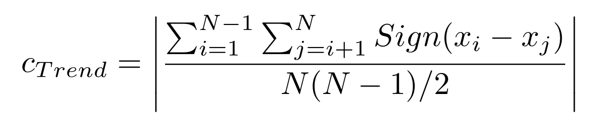
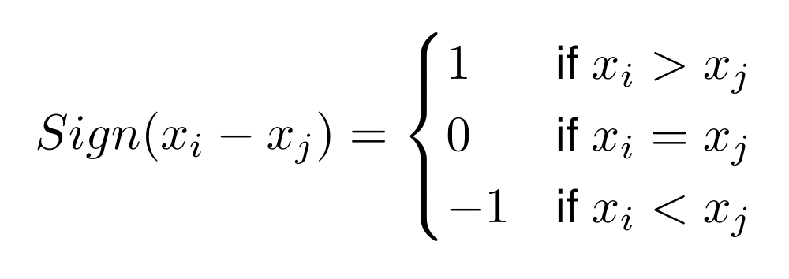
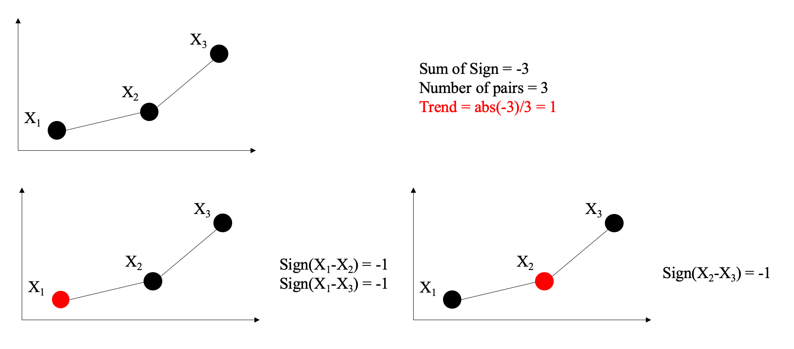

## Welcome to Representation Page
Click [here](https://idatavisualizationlab.github.io/B/congnostics/layout.html) to go to the prototype

## Monday, January 20th, 2020

### Content
1. Quantities for diagnosing features/partterns of time series.
2. Use cases of the proposed quantities.
3. Drawback of the proposed quantites.
4. Future works

### 1. Quantities for diagnosing features/partterns of time series.
1.1. Trend
I use non-parametric Mann-Kendall test:

where

The picture below shows how to calculate the trend measure.

