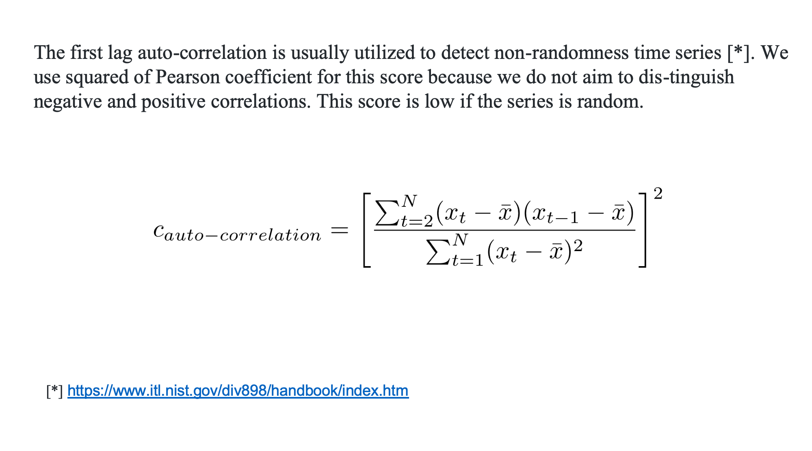

## Welcome to Representation Page
Click [here](https://idatavisualizationlab.github.io/B/congnostics/layout.html) to go to the prototype

## Monday, January 20th, 2020

### Content
1. Quantities for diagnosing features/partterns of time series.
2. Use cases of the proposed quantities.
3. Drawback of the proposed quantites.
4. Future works

### 1. Quantities for diagnosing features/partterns of time series.
1.1. Trend

I use non-parametric Mann-Kendall test:

1.2. Periodicity

The periodogram element is squared of the Fourier coefficient of the series. We score the periodicity measure of a time series as the sum of all peaks in the periodogram, and divide it by sum of all elements to get standardized value.

1.3. Auto-correlation

1.4. Mean and Standard deviation

1.6. Mean and Standard deviation of the first difference

The first difference:

Mean and Standard deviaiton of the first difference

1.7. Net outlying

We use box-plot rule for detecting outliers of values of time series and the first difference.

