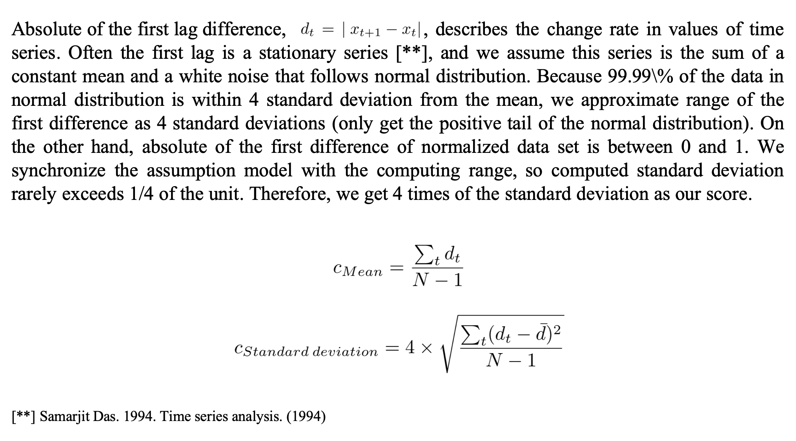
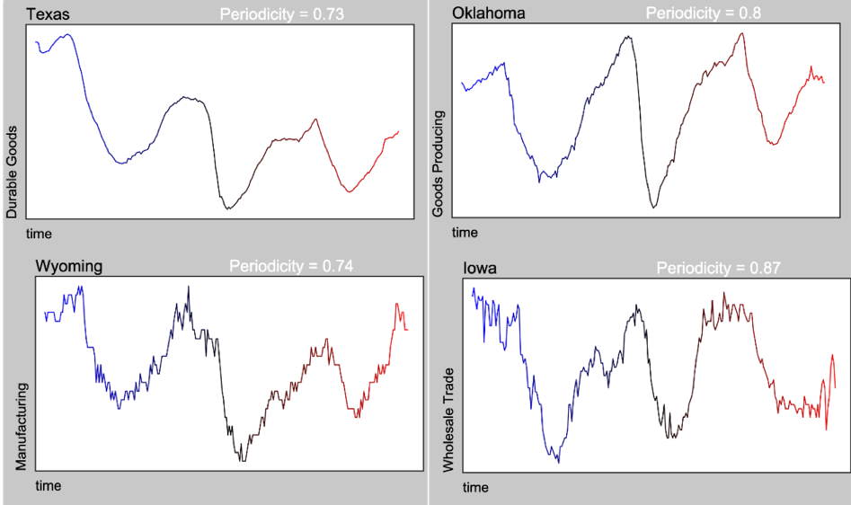
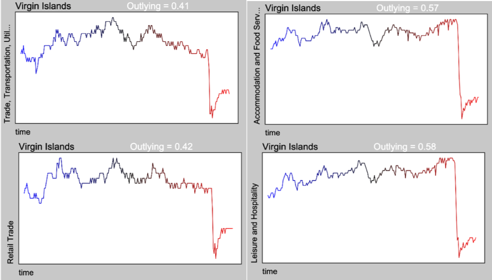

## Welcome to Representation Page
Click [here](https://idatavisualizationlab.github.io/B/congnostics/layout.html) to go to the prototype

## Monday, January 20th, 2020

### Content
1. Quantities for diagnosing features/partterns of time series.
2. Use cases of the proposed quantities.
3. Future works

### 1. Quantities for diagnosing features/partterns of time series.
1.1. Trend

I use non-parametric Mann-Kendall test:

1.2. Periodicity

The periodogram element is squared of the Fourier coefficient of the series. We score the periodicity measure of a time series as the sum of all peaks in the periodogram, and divide it by sum of all elements to get standardized value.

1.3. Auto-correlation

1.4. Mean and Standard deviation

1.6. Mean and Standard deviation of the first difference

1.7. Outlying and Net outlying

We use box-plot rule for detecting outliers of values of time series and the first difference.

The feagure below shows the summary of all quantities.

### 2. Use cases of the proposed quantities.
Data set: US employment data.
Dimension: 53 states with 34 economic sectors.
Number of time series: 1727 time series.
Values: number of employees in thousands.
Size: monthly records over 21 years from 1999 to 2019 (252 time steps).

Cycles in some economic sectors:

Impact of hurricane Irma and Maria on Virgin Islands in 2018.

Irregular increases in Federal Government employment in May 2000 and May 2010.

### 3. Future works

- Implement dimension reduction techniques to feature space.
- Improve the interaction of the prototype.
