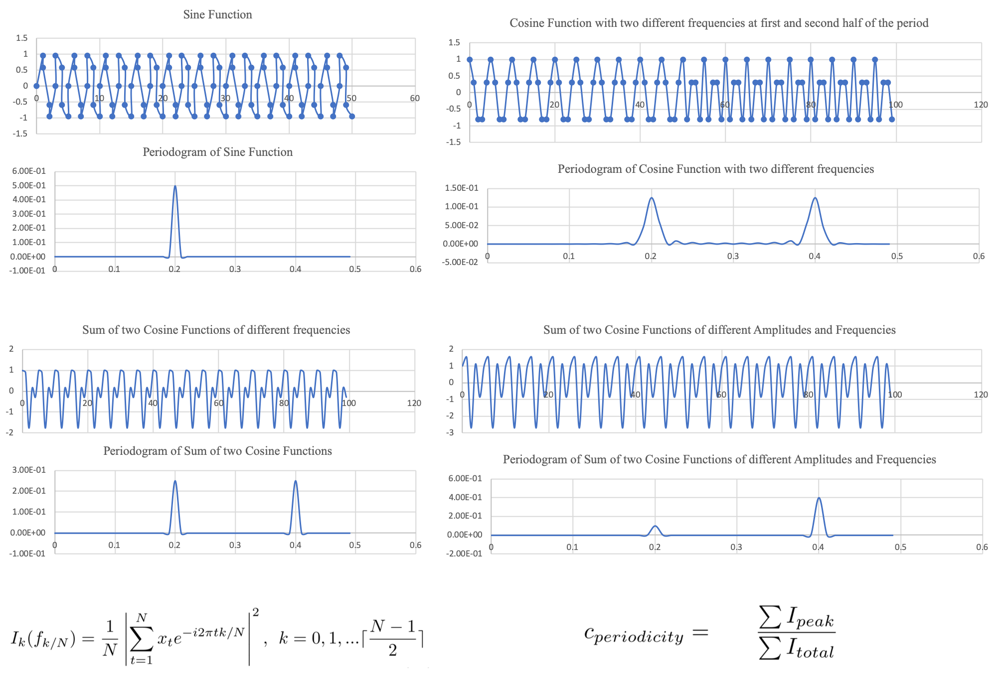

## Welcome to Representation Page
Click [here](https://idatavisualizationlab.github.io/B/congnostics/layout.html) to go to the prototype

## Monday, January 20th, 2020

### Content
1. Quantities for diagnosing features/partterns of time series.
2. Use cases of the proposed quantities.
3. Drawback of the proposed quantites.
4. Future works

### 1. Quantities for diagnosing features/partterns of time series.
1.1. Trend

I use non-parametric Mann-Kendall test [12]:

where

The picture below shows how to calculate the trend measure.

1.2. Periodicity

Two common approaches for detecting periodicity time series are periodogram and auto-correlation. The latter is difficult to automatically determine periods [20], so we use the former for this score. The periodogram element is squared of the Fourier coefficient of the series [3, 20]:

Some examples of periodogram are given in the following picture.

We score the periodicity measure of a time series as the sum of all peaks in the periodogram, and divide it by sum of all elements to get standardized value. The multiplier, 2, ensures a simple sine or cosine functions get value of 1.

1.3. Auto-correlation

The first lag auto-correlation is usually utilized to detectnon-randomness time series [14]. We use squared of Pear-son coefficient for this score because we do not aim to dis-tinguish negative and positive correlations. This score is lowif the series is random.

1.4. Mean and standard deviation

Because these measures are computed for normalized data, it is obvious to notice that the mean quantity have values between 0 and 1. In term of standard deviation, if the series is independent and identically random, its mean tends to be half of the unit, and thus, the absolute deviation from the mean of each observation is approximately not greater than a half. This leads to the fact that the range of standard deviation is from zero to around a half, so we multiply it by two to get a normalized score. If this quantity exceeds 1, we force it to be 1.

